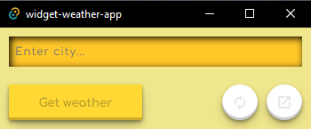
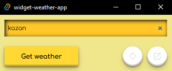
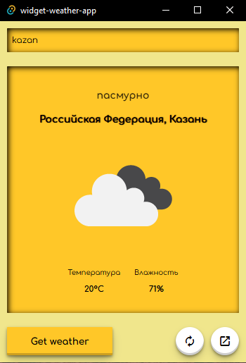
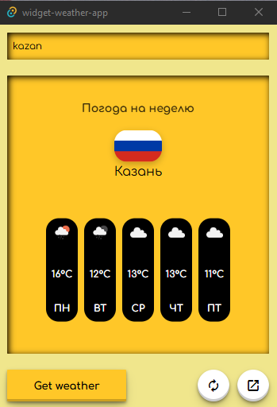
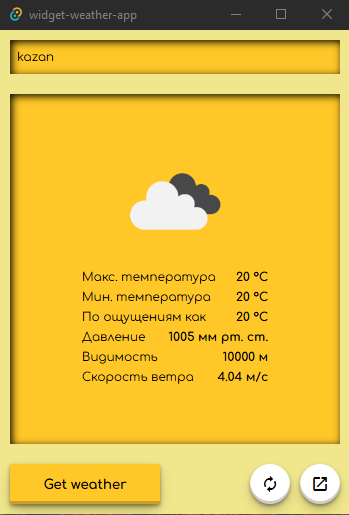
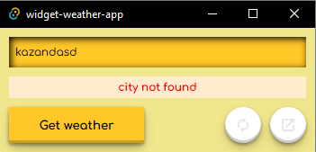

# Widget Weather


### This is a weather widget that shows basic weather information for any city in any country.







### If you couldn't find the city and got an error



## Development

To run the standard web version in development:

```bash
npm run start
```

To run the desktop version in development (Tauri):

```bash
npm run tauri dev
```